# คู่มือการใช้งานเว็บไซต์ OCEC

ปรับปรุง 4 ตุลาคม 2569

คู่มือนี้แนะนำการใช้งานเว็บไซต์ค้นหาเกียรติบัตรสำหรับผู้ใช้ทั่วไป และการจัดการข้อมูลสำหรับแอดมิน

- เว็บไซต์ค้นหา: [https://web-production-43608.up.railway.app](https://web-production-43608.up.railway.app)
- หน้าแอดมิน: [https://web-production-43608.up.railway.app/admin](https://web-production-43608.up.railway.app/admin)

> ภาพประกอบในคู่มือนี้มีทั้งภาพหน้าจอจริงจากเว็บไซต์ที่ได้รับจากผู้ดูแล และภาพสรุปขั้นตอน ภาพหน้าจอจริงที่มีข้อมูลผู้เข้าสอบรายบุคคลจะไม่นำมาแสดง เพื่อคุ้มครองข้อมูลส่วนบุคคล ภาพหน้าจออาจแตกต่างจากระบบปัจจุบันเมื่อมีการปรับปรุงเว็บไซต์

## สารบัญ

- [คู่มือการใช้งานผู้ใช้](#user-guide)
  - [1. การค้นหา](#user-search)
  - [2. การดาวน์โหลด](#user-download)
  - [3. หากพบปัญหา ต้องทำอย่างไร](#user-troubleshooting)
  - [4. ข้อควรรู้เพิ่มเติม](#user-notes)
- [คู่มือการใช้งานแอดมิน](#admin-guide)
  - [1. การเข้าสู่ระบบ](#admin-login)
  - [2. การเพิ่มรายการสอบและรอบนำเข้า](#admin-exams)
  - [3. การนำเข้าเกียรติบัตร](#admin-import)
    - [3.1 รูปแบบไฟล์ Excel](#admin-excel)
    - [3.2 รูปแบบไฟล์ ZIP](#admin-zip)
  - [4. ขั้นตอนการจับคู่ของระบบ](#admin-matching)
  - [5. รายการที่ระบบประมวลผลไม่ได้และต้องให้แอดมินตัดสินใจ](#admin-decisions)
  - [6. การค้นหาและแก้ไขข้อมูลรายคน](#admin-participants)
  - [7. การเพิ่มรายชื่อตกหล่น](#admin-add-missing)
  - [8. การตรวจสอบและเผยแพร่](#admin-publish)
  - [9. การดูแลรอบนำเข้าและปิดปรับปรุง](#admin-maintenance)
  - [10. ปัญหาที่แอดมินพบบ่อย](#admin-troubleshooting)

---

## คู่มือการใช้งานผู้ใช้

### 1. การค้นหา

1. เปิด [หน้าเว็บค้นหาเกียรติบัตร](https://web-production-43608.up.railway.app)
2. พิมพ์ชื่อผู้เข้าสอบเป็น **ภาษาอังกฤษ** ระบบค้นหาจากชื่อภาษาอังกฤษที่บันทึกไว้
3. พิมพ์อย่างน้อย **3 ตัวอักษร** แล้วกด **ค้นหา** หรือกด Enter
4. หากทราบชื่อเต็ม ให้พิมพ์ทั้งชื่อและนามสกุล หากไม่พบ ให้ลองค้นเฉพาะชื่อหรือนามสกุล

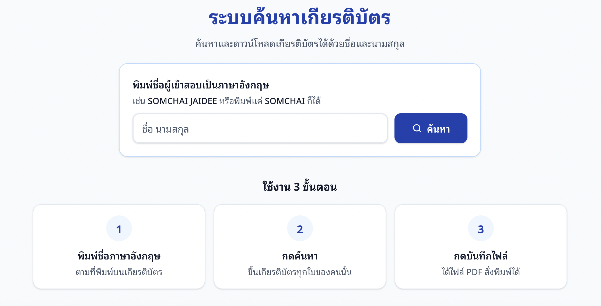

เมื่อพบผลลัพธ์ ระบบจะแสดงชื่อผู้เข้าสอบ รายการสอบ ปี รอบ และรางวัล เกียรติบัตรของคนเดียวกันจะแสดงรวมกันตามรายการสอบและปี หากมีผู้เข้าสอบชื่อคล้ายกันหลายคน ให้ตรวจข้อมูลประกอบที่แสดง เช่น โรงเรียน ระดับชั้น และเลขที่สอบ แล้วเลือกให้ตรงกับผู้เข้าสอบที่ต้องการ

> ระบบไม่ค้นหาด้วยชื่อภาษาไทยหรือเลขผู้เข้าสอบในหน้าสาธารณะ และจะแสดงเฉพาะเกียรติบัตรที่เผยแพร่แล้วและยังมีไฟล์ให้ดาวน์โหลด

### 2. การดาวน์โหลด

1. ตรวจชื่อผู้เข้าสอบให้ถูกต้อง หากพบชื่อคล้ายกันหลายคน ให้เลือกผลที่ตรงกับโรงเรียน ระดับชั้น หรือเลขที่สอบ
2. ตรวจรายการสอบ ปี รอบ และชื่อรางวัลของเกียรติบัตรที่ต้องการ
3. กดปุ่ม **บันทึกรูปภาพ** ที่การ์ดของเกียรติบัตรใบนั้น
4. ตรวจโฟลเดอร์ดาวน์โหลดของอุปกรณ์ หากต้องการเก็บหลายใบ ให้ดาวน์โหลดทีละใบและตั้งชื่อไฟล์ให้ง่ายต่อการค้นหา

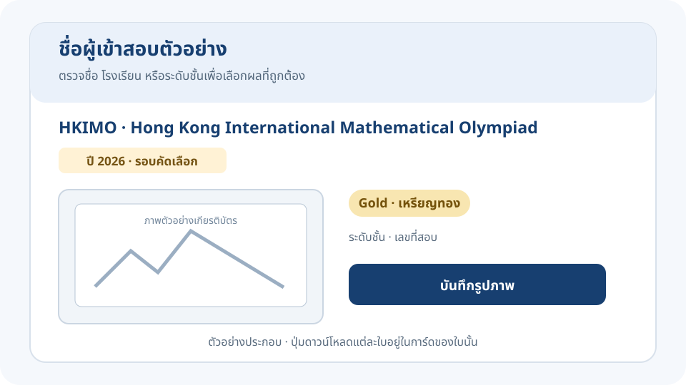

ปัจจุบันปุ่มดาวน์โหลดจะบันทึกเกียรติบัตรเป็น **ไฟล์รูปภาพ WebP** นามสกุลไฟล์เป็น .webp ไม่ใช่ไฟล์ PDF ระบบตั้งชื่อไฟล์โดยอ้างอิงชื่อผู้เข้าสอบ รายการสอบ รอบ รางวัล และปี

### 3. หากพบปัญหา ต้องทำอย่างไร

| ปัญหา | วิธีดำเนินการ |
|---|---|
| ค้นหาด้วยชื่อภาษาไทยแล้วไม่พบ | พิมพ์ชื่อเป็นภาษาอังกฤษตามที่ปรากฏบนเกียรติบัตร |
| ระบบแจ้งว่าต้องพิมพ์อย่างน้อย 3 ตัวอักษร | พิมพ์ชื่อภาษาอังกฤษอย่างน้อย 3 ตัวอักษร |
| ค้นหาชื่อเต็มแล้วไม่พบ | ลองค้นเฉพาะชื่อต้น ลองเฉพาะนามสกุล และตรวจตัวสะกดภาษาอังกฤษ |
| พบชื่อหลายรายการ | ตรวจโรงเรียน ระดับชั้น และเลขที่สอบก่อนเลือกเกียรติบัตร |
| ไม่พบเกียรติบัตร ทั้งที่คาดว่าควรมี | ตรวจชื่อและปีที่ค้นอีกครั้ง หากยังไม่พบให้ติดต่อแอดมินผ่าน [Line Official Account: OCEC_Thailand](https://lin.ee/3hzFg1z) |
| ระบบแจ้งว่าค้นหาถี่เกินไป | รอประมาณ 1 นาที แล้วลองค้นหาอีกครั้ง |
| ระบบปิดปรับปรุงชั่วคราว | กลับมาใช้งานภายหลัง เมื่อแอดมินเปิดระบบแล้วจะค้นหาและดาวน์โหลดได้ตามปกติ |
| กดดาวน์โหลดแล้วไม่พบไฟล์ | ตรวจโฟลเดอร์ดาวน์โหลดของอุปกรณ์ และตรวจการแจ้งเตือนจากเบราว์เซอร์ หากยังดาวน์โหลดไม่ได้ให้แจ้งแอดมินพร้อมชื่อรายการสอบ ปี และรอบ |

เมื่อติดต่อแอดมิน โปรดแจ้งชื่อภาษาอังกฤษ รายการสอบ ปี และรอบที่เกี่ยวข้อง เพื่อให้ตรวจสอบได้รวดเร็ว ไม่ควรส่งรหัสผ่านแอดมินหรือข้อมูลส่วนบุคคลที่ไม่เกี่ยวข้องไปในข้อความ

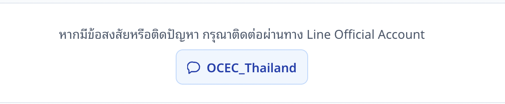

### 4. ข้อควรรู้เพิ่มเติม

- เกียรติบัตรที่แสดงในผลค้นหาอาจมีหลายรางวัลหรือหลายรอบ โปรดตรวจรายละเอียดของแต่ละการ์ดก่อนบันทึก
- ระบบแสดงข้อมูล Online หรือ Onsite เฉพาะในหลังบ้าน ผู้ใช้ทั่วไปไม่เห็นข้อมูลส่วนนี้
- ระบบเก็บไฟล์เกียรติบัตรไว้ 2 ปีนับจากวันที่เผยแพร่ หลังจากนั้นไฟล์จะถูกนำออกจากระบบและไม่สามารถดาวน์โหลดได้ แนะนำให้บันทึกไฟล์ไว้เมื่อค้นพบ
- หากข้อมูลบนเกียรติบัตรไม่ถูกต้อง หรือไม่พบรายการที่ควรมี ให้ติดต่อแอดมินผ่าน Line Official Account

---

## คู่มือการใช้งานแอดมิน

### หลักการก่อนเริ่มงาน

1. รายชื่อผู้เข้าสอบเป็นข้อมูลหลักของรอบ ต้องนำเข้าและกดยืนยันใช้ก่อนอัปโหลด ZIP
2. ระบบจะจับคู่อัตโนมัติเฉพาะกรณีที่ข้อมูลชัดเจน หากชื่อ เลข รูปแบบการสอบ หรือข้อมูลอื่นขัดแย้งกัน ระบบจะพักรายการไว้ให้ตรวจ
3. การสร้างผู้เข้าสอบรายใหม่เป็นการตัดสินตัวบุคคล ต้องอ้างอิงรายชื่อหรือหลักฐานจากต้นทาง ห้ามสร้างรายใหม่เพียงเพราะชื่อคล้ายหรือข้อมูลอ่านไม่ชัด
4. รางวัลมาจากชื่อโฟลเดอร์ภายใน ZIP เท่านั้น ไม่ใช้ข้อความบนเกียรติบัตรหรือคอลัมน์รางวัลใน Excel เป็นตัวกำหนด
5. ขณะรอบเผยแพร่อยู่ ระบบจะล็อกการอัปโหลดและแก้ไข ต้องยกเลิกการเผยแพร่ก่อน
6. การแก้ไขและการตัดสินรายการจะถูกบันทึกในประวัติของระบบ

### 1. การเข้าสู่ระบบ

1. เปิด [หน้าแอดมิน](https://web-production-43608.up.railway.app/admin)
2. กรอกรหัสผ่านแอดมินที่หน่วยงานกำหนด แล้วกด **เข้าสู่ระบบ**
3. เมื่อเข้าสู่ระบบสำเร็จ จะเห็นหน้า **รอบการนำเข้า**
4. ใช้ปุ่ม **ออกจากระบบ** เมื่อเสร็จงาน หรือเมื่อใช้อุปกรณ์ที่ผู้อื่นเข้าถึงได้

หน้าเข้าสู่ระบบใช้รหัสผ่านแอดมิน ไม่มีช่องชื่อผู้ใช้ คู่มือนี้ไม่ระบุรหัสผ่าน เพื่อไม่เผยแพร่ข้อมูลสำหรับเข้าถึงหลังบ้าน

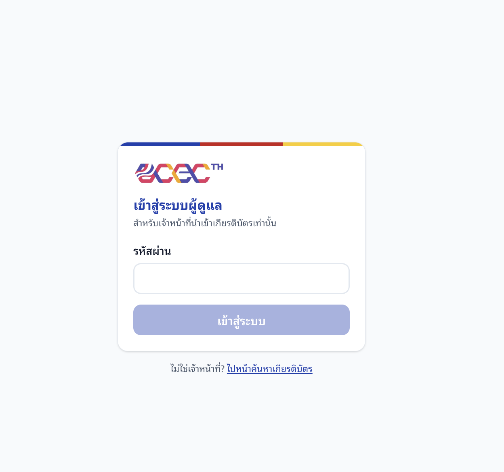

### 2. การเพิ่มรายการสอบและรอบนำเข้า

หน้า **รอบการนำเข้า** แสดงตารางแยกตามปี โดยมีรายการสอบเป็นแถว และรอบคัดเลือกกับรอบชิงชนะเลิศเป็นคอลัมน์

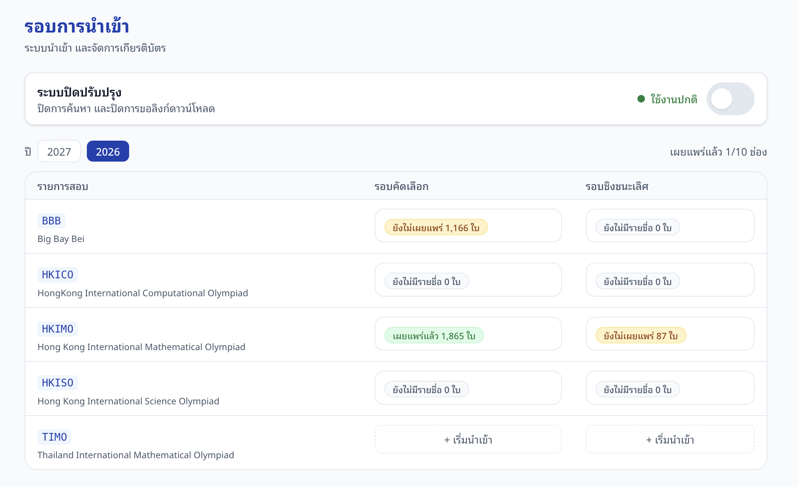

#### สร้างรอบนำเข้า

1. เลือกปีจากปุ่มปีด้านบนตาราง
2. เลือกแถวรายการสอบและคอลัมน์รอบที่ต้องการ
3. หากช่องนั้นยังไม่มีรอบ ให้กด **+ เริ่มนำเข้า** ระบบจะสร้างรอบและเปิดหน้าจัดการ
4. หากมีรอบอยู่แล้ว ให้คลิกช่องนั้นเพื่อเปิดรอบเดิม

หนึ่งรายการสอบ หนึ่งรอบ และหนึ่งปี มีรอบนำเข้าได้หนึ่งรอบเท่านั้น หากมีการกดซ้ำ ระบบจะพาไปยังรอบที่มีอยู่แล้ว ในหนึ่งรอบใช้รายชื่อชุดเดียวที่มีทั้ง Online และ Onsite

#### เพิ่มรายการสอบใหม่

1. ที่หน้า **รอบการนำเข้า** เปิดส่วน **จัดการรายการสอบ**
2. เลือก **เพิ่มรายการสอบใหม่**
3. กรอกรหัสย่อที่ไม่ซ้ำและชื่อเต็มของรายการสอบ แล้วกด **เพิ่มรายการสอบ**

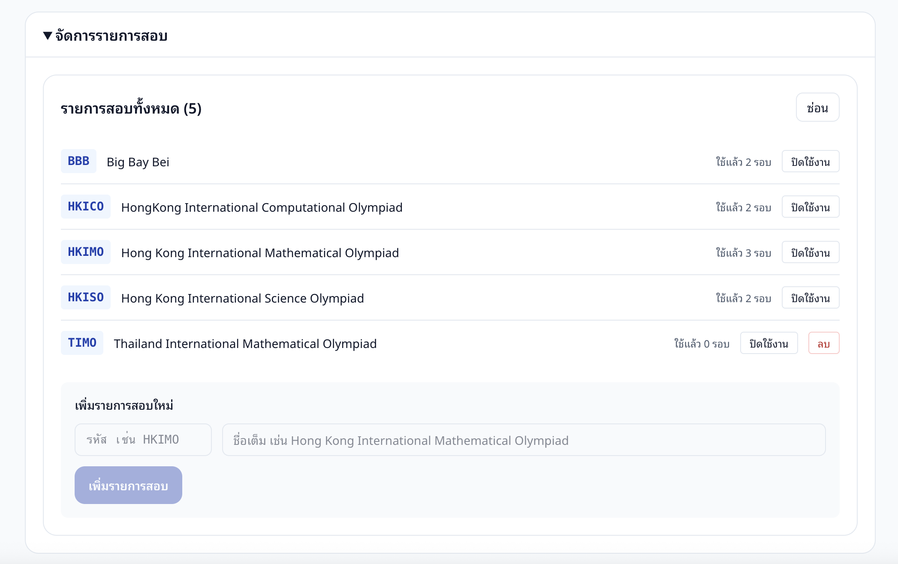

การเพิ่มรหัสและชื่อในหน้าจัดการรายการสอบเป็นการเพิ่มรายการในตารางเท่านั้น ยังไม่ได้เพิ่มความสามารถอ่านรูปแบบเกียรติบัตร หากรายการหรือรอบแสดง **ยังไม่รองรับ** ต้องให้ผู้ดูแลระบบเพิ่มโปรไฟล์อ่านเกียรติบัตรก่อนจึงจะนำเข้าได้ ปัจจุบันระบบรองรับ HKIMO, TIMO, BBB, HKICO และ HKISO ทั้งรอบ Heat และ Final

รายการสอบที่มีรอบใช้งานแล้วจะลบไม่ได้ แต่สามารถปิดใช้งานเพื่อไม่ให้สร้างรอบใหม่จากรายการนั้นได้

### 3. การนำเข้าเกียรติบัตร

แต่ละรอบมี 3 ขั้นตอนตามลำดับนี้

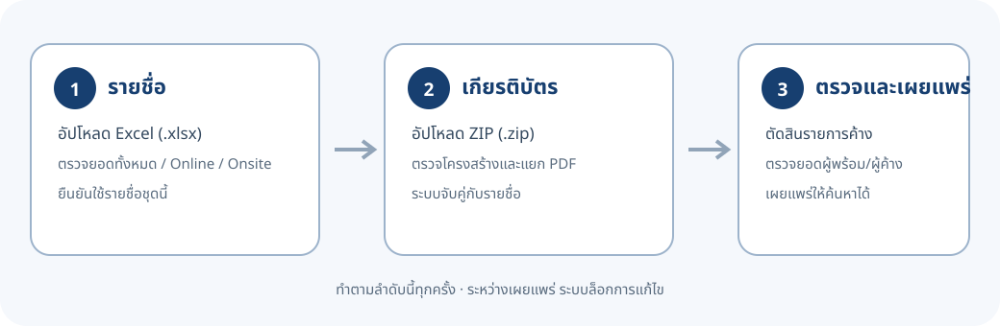

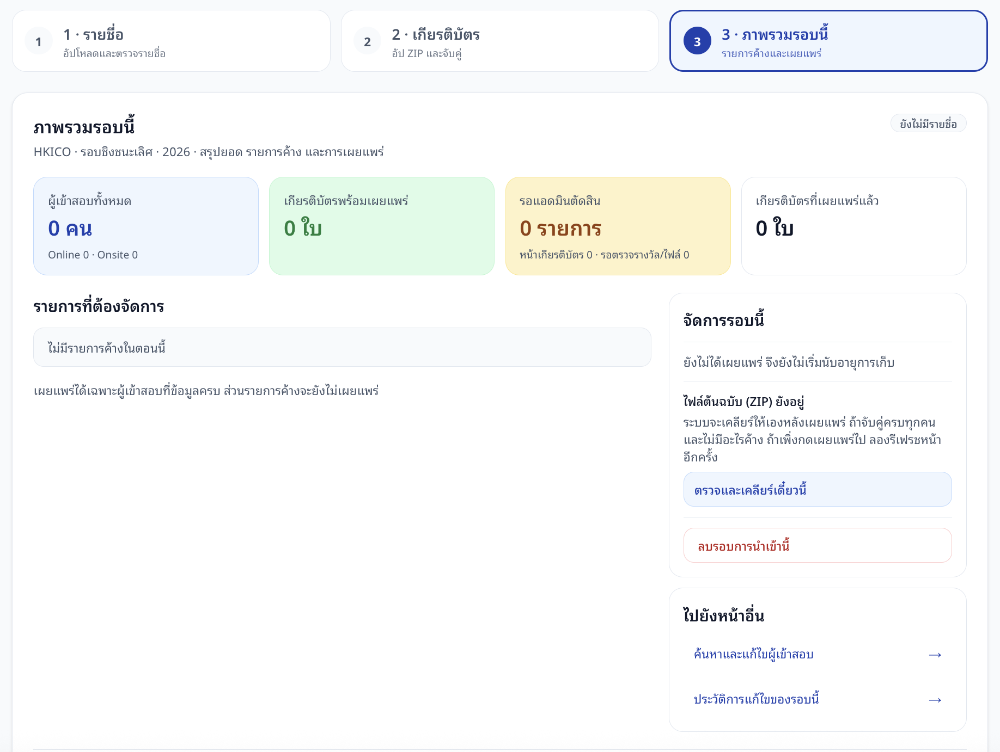

1. **รายชื่อ** — อัปโหลด Excel ตรวจยอดและยืนยันใช้รายชื่อ
2. **เกียรติบัตร** — อัปโหลด ZIP ระบบตรวจโครงสร้าง แยกหน้า และจับคู่
3. **ภาพรวมรอบนี้** — ตรวจรายการที่ต้องตัดสิน ตรวจคนที่ยังขาดไฟล์ แล้วเผยแพร่

ระบบจะแจ้งเมื่อกำลังประมวลผล โปรดรอให้งานรอบนั้นเสร็จก่อนอัปโหลดซ้ำหรือแก้ข้อมูล

#### 3.1 รูปแบบไฟล์ Excel

อัปโหลดไฟล์ Excel นามสกุล **.xlsx** โดยใช้ไฟล์เดียวรวมผู้เข้าสอบ Online และ Onsite

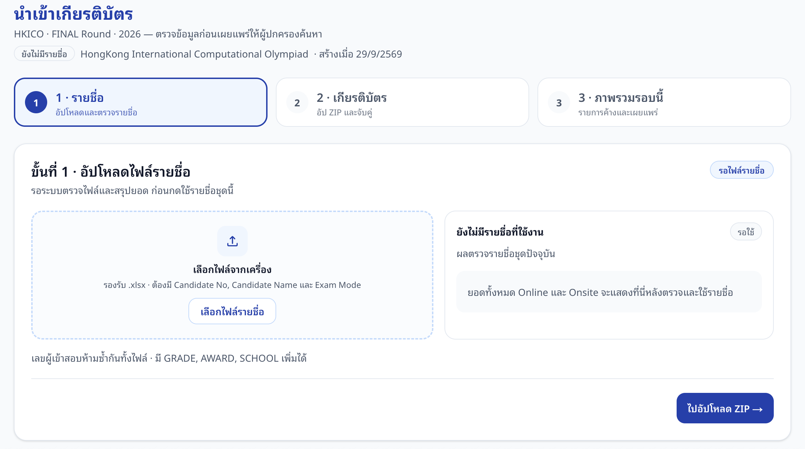

| หัวคอลัมน์ | จำเป็นหรือไม่ | ข้อกำหนดและการใช้งาน |
|---|---|---|
| CANDIDATE NO | จำเป็น | เลขผู้เข้าสอบ ต้องเป็นตัวเลขล้วน ไม่ซ้ำกันทั้งไฟล์ และตรงกับ Cert No บนเกียรติบัตร |
| CANDIDATE NAME | จำเป็น | ต้องมีชื่อผู้เข้าสอบอย่างน้อยหนึ่งภาษา ใช้ตรวจเทียบกับชื่อบนเกียรติบัตร แนะนำให้ใช้ภาษาอังกฤษตามที่พิมพ์บนใบ |
| EXAM MODE | จำเป็น | ระบุ ONLINE หรือ ONSITE เท่านั้น ระบบไม่แยกตัวพิมพ์เล็ก/ใหญ่และตัดช่องว่างหัวท้าย |
| GRADE | ไม่จำเป็น | ระดับชั้น |
| SCHOOL | ไม่จำเป็น | โรงเรียน |
| AWARD | ไม่จำเป็น | ใช้เป็นข้อมูลประกอบเพื่อตามเก็บไฟล์ที่ขาด ไม่ใช่แหล่งกำหนดรางวัล |

ตัวอย่างหนึ่งแถวต่อไปนี้เป็นข้อมูลสมมติ รูปแบบการสอบต้องอยู่ในคอลัมน์เดียวกับข้อมูลของผู้เข้าสอบคนนั้น

| CANDIDATE NO | CANDIDATE NAME | EXAM MODE | GRADE | SCHOOL | AWARD |
|---|---|---|---|---|---|
| 123456 | SAMPLE STUDENT | ONLINE | P4 | Example School | Gold |

ระบบยอมรับหัวคอลัมน์ที่มีความหมายเดียวกัน เช่น Candidate No, เลขผู้เข้าสอบ, Candidate Name, ชื่อ-นามสกุล, Mode หรือ รูปแบบการสอบ ชื่ออาจอยู่ในคอลัมน์เดียว หรือแยกเป็น First Name กับ Last Name ก็ได้ หากมีชื่อภาษาไทยอย่างเดียว ไฟล์ยังอาจนำเข้าได้ แต่ผู้ใช้ทั่วไปค้นหาได้ด้วยชื่อภาษาอังกฤษเท่านั้น จึงควรใส่ชื่ออังกฤษตามเกียรติบัตรเมื่อมีข้อมูล

**ก่อนอัปโหลด**

- รวมรายชื่อ Online และ Onsite ไว้ในไฟล์เดียว
- ตรวจว่าเลขผู้เข้าสอบไม่ซ้ำกันข้ามสองรูปแบบการสอบ
- ตรวจชื่อให้ตรงกับภาษาอังกฤษบนเกียรติบัตรเท่าที่ทำได้
- ตรวจจำนวนคนทั้งหมด จำนวน Online และจำนวน Onsite จากต้นทาง

**หลังอัปโหลด**

1. รอให้ระบบตรวจไฟล์และแสดงผลร่าง
2. หากพบข้อผิดพลาด ระบบจะแสดงรายการแถวที่ผิดทั้งหมด ให้แก้ไฟล์แล้วอัปโหลดใหม่ รายชื่อที่ใช้อยู่จะยังไม่เปลี่ยน
3. หากร่างผ่าน ให้ตรวจยอดทั้งหมด Online และ Onsite เทียบกับต้นทาง
4. หากมีรายการที่ชนกับผู้เข้าสอบที่เพิ่มเอง ให้เลือกทีละรายการว่าจะ **คนเดียวกัน — รวมเป็นรายการเดียว** หรือ **เก็บรายการที่เพิ่มเองไว้** หากรวม ระบบให้เลือกค่าของแต่ละช่องว่าจะใช้ค่าจาก Excel หรือรายการที่เพิ่มเอง
5. เมื่อข้อมูลและยอดถูกต้อง จึงกด **ใช้รายชื่อชุดนี้**

การยืนยันใช้รายชื่อจะแทนชุดเดิมและทำให้ระบบจับคู่เกียรติบัตรในรอบนั้นใหม่ รายการที่เพิ่มเองและไม่ชนกับข้อมูล Excel จะยังคงอยู่ ส่วนรายการที่ชนต้องจัดการตามตัวเลือกที่แสดงก่อนใช้รายชื่อ

> คอลัมน์ AWARD ใน Excel ไม่ได้กำหนดรางวัลของไฟล์ ห้ามแก้ค่า AWARD เพื่อแก้ชื่อโฟลเดอร์รางวัล ให้ตรวจและแก้ชื่อโฟลเดอร์ใน ZIP ตามข้อ 3.2

#### 3.2 รูปแบบไฟล์ ZIP และไฟล์ที่ระบบรับนำเข้า

อัปโหลดไฟล์นามสกุล **.zip** หลังจากมีรายชื่อที่กดยืนยันใช้แล้ว ระบบรับไฟล์ PDF ภายใน ZIP และรองรับโครงสร้างหลัก 2 แบบ

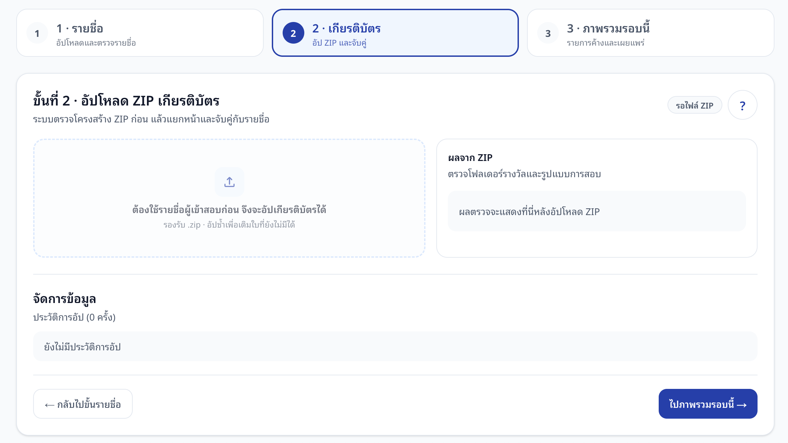

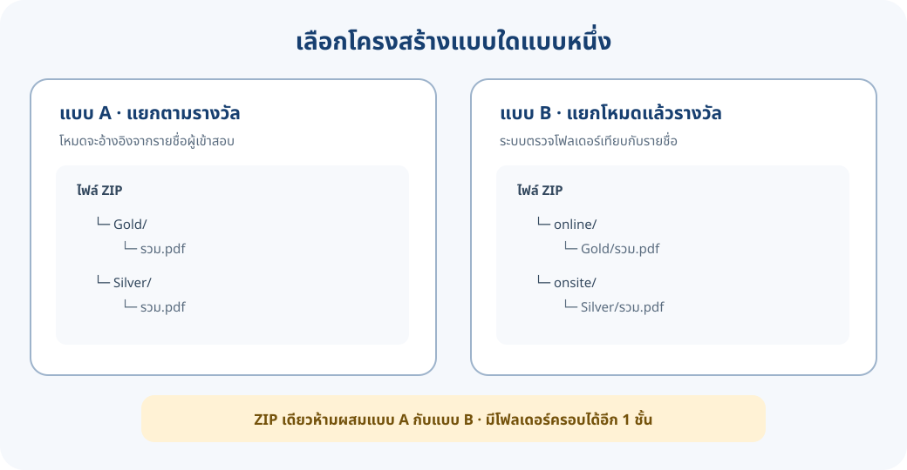

**แบบ A: แยกไฟล์ตามรางวัลอย่างเดียว**

ใช้เมื่อ PDF รวมนักเรียน Online และ Onsite ไว้ด้วยกัน ระบบใช้เลขบนใบเทียบกับรายชื่อ แล้วใช้รูปแบบการสอบจากรายชื่อ

    Gold/
        รวม.pdf
    Silver/
        รวม.pdf

**แบบ B: แยกตามรูปแบบการสอบ แล้วแยกตามรางวัล**

ใช้เมื่อไฟล์จัดแยก Online และ Onsite มาจากต้นทาง ระบบตรวจโฟลเดอร์รูปแบบการสอบเทียบกับรายชื่อ

    online/
        Gold/
            รวม.pdf
    onsite/
        Silver/
            รวม.pdf

ข้อกำหนดเพิ่มเติม:

- ZIP หนึ่งไฟล์ต้องใช้โครงสร้างแบบ A หรือแบบ B อย่างใดอย่างหนึ่ง ห้ามผสมสองแบบ
- ZIP แบบ B จะมีโฟลเดอร์ online, onsite หรือมีเพียงโฟลเดอร์เดียวก็ได้
- มีโฟลเดอร์ครอบชุดไฟล์เพิ่มได้ไม่เกิน 1 ชั้น เช่น ชื่อรายการสอบ/online/Gold/ไฟล์.pdf
- เฉพาะ HKISO รอบ Heat เท่านั้นที่มีโฟลเดอร์ระดับชั้นเพิ่มใต้รางวัลได้อีก 1 ชั้น เช่น online/Gold/P3/ไฟล์.pdf
- ระบบอ่าน PDF ทีละไฟล์และแยกข้อมูลทีละหน้า ชื่อไฟล์ PDF ตั้งอย่างไรก็ได้
- ระบบรับเฉพาะ PDF ไม่รับ JPG, PNG หรือไฟล์ภาพชนิดอื่นโดยตรง
- PDF ที่เป็นภาพสแกนและไม่มีชั้นข้อความอาจอ่านข้อมูลไม่ได้ ระบบไม่มี OCR สำหรับแปลงภาพเป็นข้อความ ควรขอ PDF ที่ส่งออกจากต้นทางและเลือกข้อความได้
- ชื่อโฟลเดอร์รางวัลต้องอยู่ในรายการที่ระบบแสดงในหน้าขั้นที่ 2 ปุ่ม **ดูโครงโฟลเดอร์ ZIP ที่รับ** ชื่อโฟลเดอร์ที่ไม่รู้จักหรือไม่ตรงกับรอบจะทำให้ ZIP ทั้งไฟล์ไม่ผ่านการตรวจ

**ชื่อโฟลเดอร์รางวัลที่รองรับ**

ระบบไม่แยกตัวพิมพ์เล็ก/ใหญ่ และปรับช่องว่าง ขีดกลาง และขีดล่างให้เป็นรูปแบบเดียวกันก่อนเทียบชื่อ เช่น Perfect_Score หรือ Perfect-Score เทียบได้กับ Perfect Score ชื่อสะกดเต็มของรางวัลที่รองรับจะแสดงในปุ่มดูโครงสร้าง ZIP ของรอบนั้นด้วย

| รายการสอบ | รางวัลและชื่อโฟลเดอร์ที่รับ | หมายเหตุ |
|---|---|---|
| HKIMO, TIMO, HKISO | Gold หรือ Gold Award; Silver หรือ Silver Award; Bronze หรือ Bronze Award; Merit หรือ Merit Award; Participation หรือ Participation Award; Perfect หรือ Perfect Score หรือ Perfect Score Award; Special หรือ Special Award | Participation ใช้ได้เฉพาะ Heat |
| HKICO | ใช้ชื่อแบบแถว HKIMO/TIMO/HKISO และเพิ่ม HKICO Gold, HKICO Silver, HKICO Bronze, HKICO Merit, HKICO Perfect Score | Participation ใช้ได้เฉพาะ Heat |
| BBB | 1st Prize, 1stPrize, 1st Prize Award หรือ Gold; 2nd Prize, 2ndPrize, 2nd Prize Award หรือ Silver; 3rd Prize, 3rdPrize, 3rd Prize Award หรือ Bronze; Merit หรือ Merit Award; Participation หรือ Participation Award; Perfect หรือ Perfect Score หรือ Perfect Score Award; Special หรือ Special Award | Participation ใช้ได้เฉพาะ Heat; Gold หมายถึง 1st Prize, Silver หมายถึง 2nd Prize และ Bronze หมายถึง 3rd Prize |

คำว่า Perfect Score และ Special Award เป็น **รางวัลเสริม** ส่วนรางวัลอื่นในตารางเป็น **รางวัลหลัก** ตามแคตตาล็อกของระบบ รางวัลของแต่ละหน้าจะอ้างอิงจากโฟลเดอร์ที่เก็บไฟล์เท่านั้น เช่น โฟลเดอร์ Perfect Score ใช้ระบุว่าเป็นรางวัล Perfect Score แม้บนใบไม่มีคำนี้พิมพ์อยู่

**เมื่อ ZIP ไม่ผ่านการตรวจ**

ระบบตรวจโครงสร้างก่อนเริ่มนำเข้า หากพบโฟลเดอร์ผิดหรือไฟล์ไม่รองรับ จะไม่รับ ZIP นั้นทั้งไฟล์และไม่แตะข้อมูลเดิม ข้อผิดพลาดจะแสดงให้แก้ในครั้งเดียว ตรวจว่าทุก PDF อยู่ใต้โฟลเดอร์รางวัลที่ถูกต้อง ไม่มีโฟลเดอร์ซ้อนเกินกำหนด และใช้โครงสร้างแบบเดียวกันทั้ง ZIP

### 4. ขั้นตอนการจับคู่ของระบบ

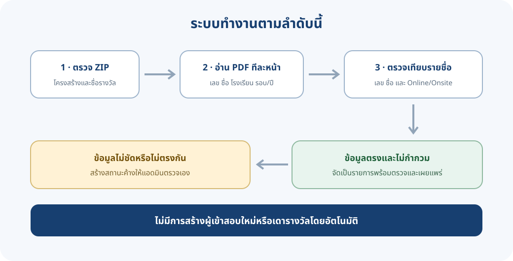

เมื่อได้รับ ZIP ระบบดำเนินงานโดยสรุปดังนี้

1. **ตรวจ ZIP** — ตรวจว่าไฟล์เปิดได้ มี PDF และโครงสร้างโฟลเดอร์ตรงกับรายการสอบและรอบ
2. **อ่าน PDF** — อ่านทีละไฟล์และทีละหน้า โดยใช้รูปแบบอ่านเกียรติบัตรของรายการสอบนั้น
3. **กำหนดรางวัล** — ใช้ชื่อโฟลเดอร์เป็นแหล่งกำหนดรางวัล ไม่ใช้ข้อความรางวัลบนหน้าและไม่ใช้คอลัมน์ AWARD ใน Excel
4. **อ่านและเทียบข้อมูล** — อ่านเลขผู้เข้าสอบและชื่อ แล้วเทียบกับรายชื่อของรอบ ตรวจระดับชั้น โรงเรียน รูปแบบการสอบ ประเทศ รอบ และปีตามข้อมูลที่อ่านได้
5. **รับเฉพาะกรณีที่ข้อมูลชัดเจน** — เมื่อเลขและชื่อสัมพันธ์กับรายชื่อและไม่มีข้อมูลขัดแย้ง ระบบจะจัดหน้าให้ผู้เข้าสอบคนนั้น
6. **พักกรณีที่ไม่ชัดเจน** — หากอ่านข้อมูลไม่ได้ ไม่พบผู้เข้าสอบ หรือข้อมูลขัดกัน ระบบจะสร้างรายการใน **หน้าที่ต้องตัดสิน** หรือ **ผู้เข้าสอบที่ต้องตรวจรางวัล/ไฟล์**
7. **รอแอดมินตรวจและเผยแพร่** — การอัปโหลดหรือจับคู่เสร็จไม่ได้ทำให้ผู้ใช้ทั่วไปเห็นเกียรติบัตรทันที ต้องตรวจยอดและกดเผยแพร่

กรณี ZIP แยกตามรางวัลอย่างเดียว ระบบใช้ Online/Onsite จากรายชื่อ หากโฟลเดอร์ ZIP ระบุโหมด ระบบจะตรวจเทียบกับรายชื่อ ถ้าบนเกียรติบัตรมีข้อความ ONLINE หรือ ONSITE ระบบจะใช้เป็นข้อมูลตรวจสอบเพิ่มเติม โรงเรียนที่ต่างจากรายชื่อเป็นคำเตือนให้ตรวจ ไม่ได้เขียนทับข้อมูลโรงเรียนจากใบโดยอัตโนมัติ

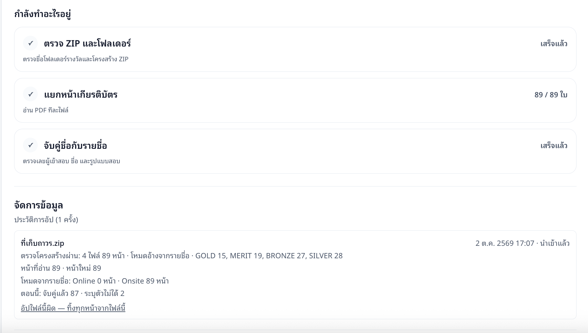

ในรอบ Final หากระบบไม่มีหลักฐานยืนยันว่าหน้านั้นเป็นของผู้เข้าสอบไทย จะพักไว้ให้แอดมินตรวจ ส่วนหน้าที่อ่านแล้วพบว่าเป็นของต่างชาติจะถูกข้าม ไม่นำเข้าเป็นเกียรติบัตรของรอบนั้น

> หากมีชื่อซ้ำหรือระบุตัวบุคคลไม่ได้ ระบบจะไม่สร้างผู้เข้าสอบใหม่ให้เอง เพราะการสร้างคนใหม่ก็เป็นการเดาว่าเป็นคนละบุคคล

### 5. รายการที่ระบบประมวลผลไม่ได้และต้องให้แอดมินตัดสินใจ

ในขั้น **ภาพรวมรอบนี้** เปิดรายการ **หน้าที่ต้องตัดสิน** เพื่อตรวจรูปตัวอย่าง ข้อมูลที่อ่านได้ รายชื่อที่ระบบเทียบ และชื่อไฟล์หรือโฟลเดอร์ต้นทาง จากนั้นเลือกการดำเนินการตามสถานะ

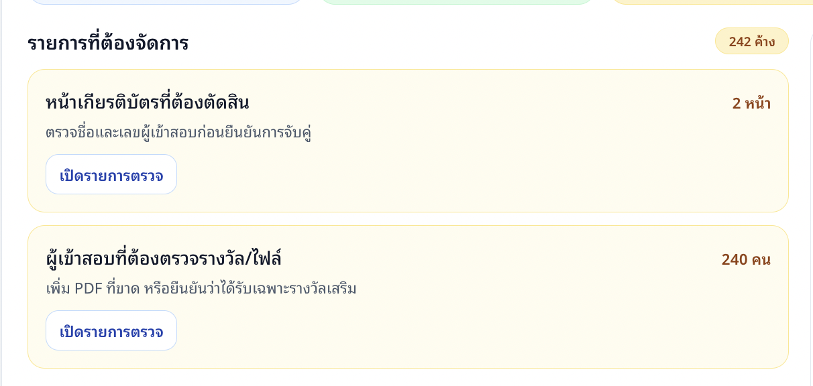

ภาพนี้แสดงยอดรายการค้างโดยรวมเท่านั้น ตัวอย่างชื่อ เลขผู้เข้าสอบ และภาพเกียรติบัตรรายบุคคลที่ปรากฏในหน้ารายการตรวจจะไม่แสดงในคู่มือนี้

**ตัวอย่างจากหน้าระบบจริง ณ วันที่ 4 ตุลาคม 2569:** รอบ HKIMO รอบชิงชนะเลิศ ปี 2026 มีผู้เข้าสอบ 329 คน ระบบอ่านเกียรติบัตรได้ 89 หน้า โดยจับคู่แล้ว 87 หน้าและพักไว้ให้แอดมินตรวจ 2 หน้า ในภาพรวมมีรายการค้าง 242 รายการ แบ่งเป็นหน้าเกียรติบัตรที่ต้องตัดสิน 2 หน้า และผู้เข้าสอบที่ต้องตรวจรางวัลหรือไฟล์ 240 คน ตัวเลขนี้เป็นเพียงตัวอย่าง ณ วันที่ตรวจและเปลี่ยนแปลงได้ตามการแก้ไขข้อมูล

#### 5.1 สถานะของหน้าเกียรติบัตร

| สถานะบนหน้าจอ | ความหมาย | ตัวเลือกและผล |
|---|---|---|
| **ชื่อไม่ตรง** (NAME_MISMATCH) | เลขผู้เข้าสอบตรงกับรายชื่อ แต่ชื่อที่อ่านจากเกียรติบัตรไม่ตรง | **คนเดียวกัน — จับคู่ด้วยมือ** เพื่อผูกหน้านี้กับผู้เข้าสอบในรายชื่อ หลังตรวจเลขและเอกสารแล้ว; **แก้ชื่อในรายชื่อ** หากข้อมูลต้นทางสะกดผิด; หรือ **ทิ้งหน้านี้** หากเป็นไฟล์ของคนอื่น หน้าที่ทิ้งจะไม่เผยแพร่และยังเก็บเป็นหลักฐาน |
| **online/onsite ไม่ตรง** (MODE_MISMATCH) | เลขและชื่อสัมพันธ์กับรายชื่อ แต่โฟลเดอร์ Online/Onsite หรือโหมดที่พิมพ์บนใบขัดกับรายชื่อ | **ใช้รูปแบบตามรายชื่อ** เพื่อยืนยันว่ารายชื่อเป็นข้อมูลที่ถูกต้อง; **ทิ้งและรอไฟล์ใหม่**; หรือแก้การจัด ZIP แล้วอัปโหลดใหม่ ระบบอาจใช้หน้าที่ถูกต้องแทนหน้าที่มีปัญหา |
| **ระบุตัวไม่ได้** (AMBIGUOUS) | อ่านเลขไม่ได้หรือมีผู้เข้าสอบชื่อเดียวกันหลายคนจนระบบเลือกให้ไม่ได้ | เลือกผู้เข้าสอบจากตัวเลือกที่แสดง โดยตรวจเลข ชื่อ โรงเรียน และหลักฐาน; ถ้าเป็นปัญหาการเชื่อมตัวคนข้ามปี ให้เปิดหน้า **เลือกว่าเป็นคนไหน** แล้วเลือกตัวคนที่ถูกต้อง หรือยืนยัน **คนใหม่ ไม่ใช่คนใดข้างบน** เมื่อมีหลักฐานยืนยันว่าเป็นคนละคนจริง; หากยังยืนยันไม่ได้ ให้ทิ้งหรือพักไว้และสอบถามต้นทาง |
| **ใบซ้ำ รอตัดสิน** (DUPLICATE_NAME) | ผู้เข้าสอบมีใบรางวัลเดียวกันอยู่แล้ว แต่หน้าที่เข้ามาเป็นไฟล์อีกหน้า | เปรียบเทียบตัวอย่างใบเดิมและใบใหม่ แล้วเลือก **ใช้หน้านี้แทนใบเดิม** หรือ **ใบซ้ำ — ทิ้งหน้านี้** หากโฟลเดอร์รางวัลผิด ให้เลือก **เปลี่ยนรางวัล** และยืนยัน ระบบเก็บชื่อรางวัลจากโฟลเดอร์ไว้เป็นหลักฐาน |
| **รอยืนยันสัญชาติ** (NATIONALITY_UNVERIFIED) | รอบ Final แต่ข้อมูลบนหน้าไม่ยืนยันว่าเป็นผู้เข้าสอบไทย | เลือก **เป็นผู้เข้าสอบไทย** เฉพาะเมื่อมีหลักฐานยืนยัน หรือ **ต่างชาติ — ไม่นำเข้า** ซึ่งจะข้ามหน้านั้นและไม่เผยแพร่ |
| **รอบ/ปีไม่ตรง** (PARSE_REVIEW) | รอบหรือปีที่อ่านจากหน้าไม่ตรงกับรอบนำเข้าปัจจุบัน | เลือก **เป็นของรอบนี้จริง — รับไว้** เมื่อยืนยันกับต้นทางแล้ว หรือ **ทิ้งหน้านี้** หากเป็นไฟล์ผิดรอบ/ปี |
| **ยังไม่มีคู่** (UNMATCHED) | ระบบไม่พบผู้เข้าสอบในรายชื่อที่ตรงกับหน้านี้ | ถ้าอ่านเลขบนใบไม่ได้ ให้กรอกเลขผู้เข้าสอบที่ตรวจจากหลักฐานแล้วกด **ผูกกับเลขนี้**; ถ้าเลขบนใบอ่านได้แต่ไม่มีในรายชื่อ ให้กด **เพิ่มเป็นผู้เข้าสอบที่ตกหล่น** แล้วตรวจและบันทึกข้อมูลตามข้อ 7; หากเป็นไฟล์ที่ไม่เกี่ยวกับรอบนี้ให้ **ทิ้งหน้านี้** |

ทุกครั้งก่อนยืนยัน ให้ดูภาพตัวอย่างและเทียบเลขผู้เข้าสอบกับข้อมูลจากต้นทาง ห้ามตัดสินจากชื่อที่เหมือนกันเพียงอย่างเดียว การเลือกคำสั่งจะบันทึกการตัดสินและให้ระบบจับคู่ข้อมูลในรอบใหม่

หน้าที่กด **ทิ้งหน้านี้** จะไม่ถูกลบออกจากประวัติการนำเข้า แต่จะไม่ถูกนำไปเผยแพร่ หน้าที่ทิ้งและยังไม่ถูกสั่งลบไฟล์ถาวรอาจคืนได้จากหน้ารายคน หากมีการอัปโหลดไฟล์ใหม่ที่ถูกต้อง หน้าเดิมที่ถูกแทนอาจแสดงเป็น **มีไฟล์ใหม่มาแทน** (SUPERSEDED)

#### 5.2 ผู้เข้าสอบที่ยังไม่มีไฟล์ หรือยังขาดรางวัลหลัก

ในรายการ **ผู้เข้าสอบที่ต้องตรวจรางวัล/ไฟล์** ระบบแสดงผู้เข้าสอบที่ยังไม่มีเกียรติบัตร และผู้ที่มีเฉพาะรางวัลเสริม

| เหตุที่ค้าง | วิธีดำเนินการ | ผล |
|---|---|---|
| **ยังไม่มีไฟล์เกียรติบัตร** (MISSING_FILE) | รอไฟล์จากต้นทางแล้วอัปโหลด ZIP เพิ่ม หรือเลือกรางวัลแล้วกด **เลือกไฟล์ PDF ที่ได้มา** ที่แถวของผู้เข้าสอบ | ระบบตรวจเลขและชื่อบน PDF กับผู้เข้าสอบที่เลือก หากตรงจะเพิ่มเฉพาะหน้า/ใบที่เกี่ยวข้อง ถ้าไม่ตรงจะแจ้งและไม่เปลี่ยนข้อมูลเดิม |
| **มีแต่ใบรางวัลเสริม** (MISSING_PRIMARY) | ตรวจยืนยันจากต้นทางว่าผู้เข้าสอบได้รับเฉพาะรางวัลเสริมจริงหรือไม่ หากยังคาดว่าจะมีรางวัลหลัก ให้รอหรือขอไฟล์เพิ่ม หากได้รับเฉพาะรางวัลเสริม ให้ตรวจเลข ชื่อ และไฟล์ แล้วกด **ยืนยันใช้เฉพาะรางวัลที่มีอยู่** | ระบบอนุญาตให้เผยแพร่รางวัลเสริมชุดที่ยืนยัน แม้ไม่มีรางวัลหลัก หากไฟล์หรือรางวัลเปลี่ยน ต้องตรวจและยืนยันชุดปัจจุบันใหม่ |
| **รูปเกียรติบัตรยังไม่พร้อม** (IMAGE_PENDING) | รอให้ระบบประมวลผลรูปเสร็จ แล้วรีเฟรชหน้าภาพรวม หากค้างนานหรือมีข้อความผิดพลาด ให้ส่งรายละเอียดงานให้ผู้ดูแลระบบ | ระบบยังไม่เผยแพร่คนที่รูปยังไม่พร้อม จนกว่าระบบสร้างรูปตัวอย่างได้ |

ในส่วนของแต่ละคนสามารถเลือกไฟล์ PDF รวมหลายหน้าได้ ระบบจะค้นหน้าที่ตรงกับผู้เข้าสอบคนนั้น หากไม่สามารถระบุหน้าได้ ให้แยกหน้าที่ต้องการเป็น PDF แล้วอัปโหลดใหม่ รางวัลของไฟล์รายคนต้องเลือกจากเมนูเองทุกครั้ง ระบบไม่เดาจากข้อความใน PDF หรือคอลัมน์ AWARD

#### 5.3 สถานะข้อมูลที่ไม่ต้องตัดสินซ้ำ

- **ต่างชาติ (ข้าม)** (SKIPPED_FOREIGN) คือหน้าที่แอดมินยืนยันแล้วว่าเป็นผู้เข้าสอบต่างชาติในรอบที่กำหนดให้รับเฉพาะคนไทย ระบบข้ามหน้านั้น ไม่เผยแพร่
- **จับคู่แล้ว** (MATCHED) คือข้อมูลผ่านการจับคู่ แต่ยังต้องรอการตรวจและเผยแพร่ตามปกติ
- **ทิ้งแล้ว** (DISCARDED) คือแอดมินเลือกไม่นำหน้านั้นไปใช้
- **มีไฟล์ใหม่มาแทน** (SUPERSEDED) คือมีไฟล์ใหม่เข้ามาแทนหน้าเดิมที่มีปัญหา
- การจัดการรายการค้างของคนหนึ่งไม่จำเป็นต้องหยุดเผยแพร่คนอื่นที่ข้อมูลครบ ระบบแสดงจำนวนคนและใบที่พร้อม รวมถึงคนที่ยังค้างแยกตามเหตุผลก่อนเผยแพร่

### 6. การค้นหาและแก้ไขข้อมูลรายคน

จากหน้ารอบนำเข้า กด **ค้นหาและแก้ไขผู้เข้าสอบ** เพื่อเปิดรายชื่อของรอบนั้น

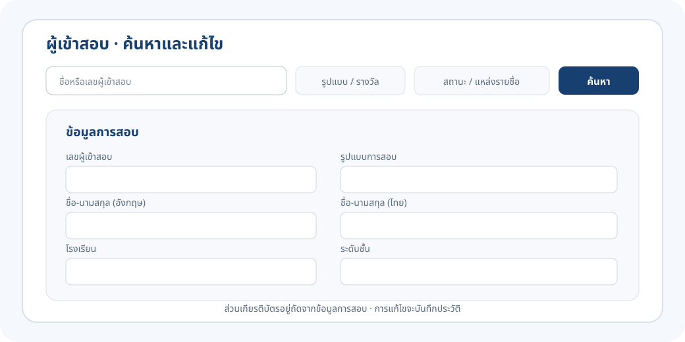

#### ค้นหารายคน

พิมพ์ชื่อหรือเลขผู้เข้าสอบ แล้วใช้ตัวกรองเพื่อจำกัดผลลัพธ์ได้ เช่น

- รูปแบบการสอบ: Online หรือ Onsite
- รางวัล
- สถานะที่ต้องตัดสิน
- ที่มาของข้อมูล: Excel หรือเพิ่มเอง
- มีเกียรติบัตรหรือยังไม่มีเกียรติบัตร

คลิกเลขผู้เข้าสอบหรือชื่อเพื่อเปิดรายละเอียดรายคน ระบบแบ่งหน้าเมื่อมีรายชื่อจำนวนมาก

#### ข้อมูลที่แก้ไขได้

| ข้อมูล | วิธีแก้ |
|---|---|
| เลขผู้เข้าสอบ | แก้ในส่วน **ข้อมูลการสอบ** แล้วกด **บันทึกและจับคู่ใหม่** เลขต้องไม่ซ้ำกับคนอื่นในรอบเดียวกัน |
| รูปแบบการสอบ | เลือก Online หรือ Onsite ตามข้อมูลที่ยืนยันจากต้นทาง |
| ชื่อภาษาอังกฤษ / ชื่อภาษาไทย | แก้ในช่องชื่อที่เกี่ยวข้อง ตรวจให้ตรงกับหลักฐาน |
| โรงเรียน / ระดับชั้น | แก้ในช่องข้อมูลการสอบ แล้วบันทึก |
| ตัวคนที่เชื่อมข้ามรายการสอบหรือปี | ใช้กล่อง **ตัวคน** เลือกตัวคนที่ตรงกับผู้เข้าสอบ หรือแยกเป็นคนใหม่ตามหลักฐาน |
| ไฟล์เกียรติบัตรและรางวัล | ใช้ส่วน **เกียรติบัตร** เพื่อเพิ่มใบ เปลี่ยนไฟล์ เปลี่ยนรางวัล ทิ้ง หรือคืนหน้าที่ทิ้งไว้ |

เมื่อบันทึกข้อมูลการสอบ ระบบจะจับคู่เกียรติบัตรใหม่ ถ้ารายการมีที่มาจาก Excel การอัปโหลดและยืนยัน Excel ชุดใหม่อาจเขียนค่าของรายการนั้นทับค่าที่แก้ในหน้ารายคนได้ ควรแก้ข้อมูลในไฟล์ต้นทางด้วยก่อนอัปโหลดครั้งถัดไป ผู้เข้าสอบที่เพิ่มเองจะคงอยู่หลังอัปโหลด Excel รอบใหม่ เว้นแต่จะชนกับข้อมูลในไฟล์

#### การแก้ความสัมพันธ์ของตัวคน

ระบบเชื่อมเกียรติบัตรจากหลายรายการสอบหรือหลายปีไว้ใต้ตัวคนเดียวกัน เพื่อให้ค้นหาได้ในผลลัพธ์เดียว

- หากชื่อคล้ายกันแต่เป็นคนละคน ให้เลือกตัวคนที่ถูกต้อง หรือเลือก **คนใหม่ ไม่ใช่คนใดข้างบน** เฉพาะเมื่อมีหลักฐานยืนยัน
- หากพบว่าผู้เข้าสอบรอบนี้ผูกกับตัวคนผิด ให้กด **ผูกผิดคน — แยกเป็นคนใหม่** ใบของรายการอื่นจะยังอยู่กับตัวคนเดิม
- หากต้องเปลี่ยนไปผูกกับตัวคนเดิม ให้กด **เปลี่ยนตัวคนที่ผูก** เลือกคนที่ถูกต้อง แล้วพิมพ์เลขผู้เข้าสอบเพื่อยืนยัน
- การแก้ชื่อของตัวคนที่เชื่อมอยู่กับเกียรติบัตรหลายใบอาจเปลี่ยนชื่อที่แสดงในรายการอื่นด้วย หากเป็นคนละคน ให้แยกเป็นคนใหม่แทนการแก้ชื่อ

#### การจัดการไฟล์ในหน้ารายคน

- **เพิ่มเกียรติบัตร** — เลือกรางวัลให้ตรงกับไฟล์ แล้วอัปโหลด PDF ระบบตรวจเลขและชื่อก่อนรับ
- **เปลี่ยนไฟล์ PDF** — ใช้เมื่อไฟล์เดิมผิดหรืออ่านไม่ได้ ไฟล์ใหม่ต้องเป็นของผู้เข้าสอบคนนี้และผ่านการตรวจ ใบเดิมยังถูกเก็บเป็นหลักฐาน
- **เปลี่ยนรางวัล** — เลือกรางวัลที่ถูกต้องและยืนยัน ระบบเก็บรางวัลที่อ่านจากโฟลเดอร์เดิมไว้ในประวัติ
- **ทิ้ง / คืนหน้า** — การทิ้งทำให้หน้านั้นไม่ถูกเผยแพร่ แต่ยังเก็บไว้ในระบบ หากยังไม่สั่งลบไฟล์ถาวร สามารถคืนได้จากหน้าของผู้เข้าสอบ

หากหน้ารอบนำเข้าเผยแพร่อยู่ ปุ่มอัปโหลดและแก้ไขจะถูกล็อก ให้เตรียมข้อมูลและไฟล์ที่ถูกต้องก่อน แล้วจึงยกเลิกการเผยแพร่เพื่อแก้ไข

### 7. การเพิ่มรายชื่อตกหล่น

ใช้เมื่อตรวจสอบกับต้นทางแล้วว่าผู้เข้าสอบมีอยู่จริง แต่ไม่มีชื่อใน Excel ที่ใช้งานอยู่ เริ่มได้จากปุ่ม **เพิ่มผู้เข้าสอบที่ตกหล่น** ในหน้าค้นหาและแก้ไข หรือจากปุ่มเดียวกันในการ์ด **ยังไม่มีคู่**

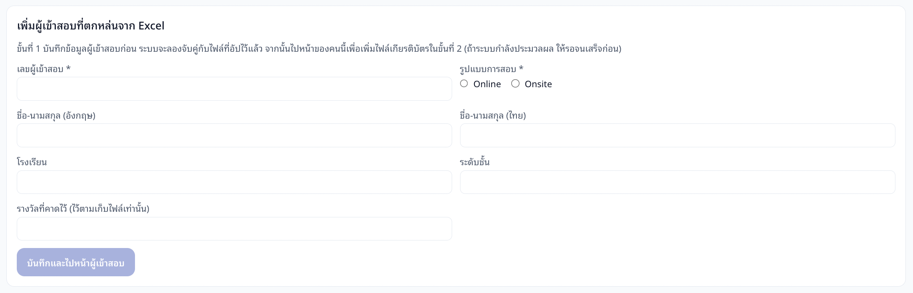

กรอกข้อมูลต่อไปนี้

| ช่องข้อมูล | จำเป็นหรือไม่ | วิธีกรอก |
|---|---|---|
| เลขผู้เข้าสอบ | จำเป็น | กรอกตามรายชื่อหรือหลักฐานจากต้นทาง ห้ามซ้ำกับผู้เข้าสอบคนอื่นในรอบ |
| รูปแบบการสอบ | จำเป็น | เลือก Online หรือ Onsite ตามข้อมูลที่ยืนยันแล้ว |
| ชื่อ-นามสกุลภาษาอังกฤษ | ต้องกรอกอย่างน้อยหนึ่งภาษา | กรอกให้ตรงกับชื่อบนใบและข้อมูลจากต้นทาง |
| ชื่อ-นามสกุลภาษาไทย | ต้องกรอกอย่างน้อยหนึ่งภาษา | กรอกเมื่อมีข้อมูลที่ยืนยันได้ |
| โรงเรียน | ไม่จำเป็น | กรอกเพื่อช่วยตรวจยืนยันตัวคน |
| ระดับชั้น | ไม่จำเป็น | กรอกตามรายชื่อ |
| รางวัลที่คาดไว้ | ไม่จำเป็น | ใช้ช่วยตามไฟล์ที่ยังขาด ไม่ได้เป็นตัวกำหนดรางวัลจริง |

ถ้ากดเพิ่มจากหน้า **ยังไม่มีคู่** แบบฟอร์มอาจเติมข้อมูลที่อ่านได้จากเกียรติบัตรให้ ตรวจทุกช่องก่อนบันทึก โดยเฉพาะเลขผู้เข้าสอบและรูปแบบการสอบ หากหลักฐานยังไม่พอ ให้สอบถามต้นทางก่อนสร้างรายการ

หลังกรอกข้อมูลแล้ว:

1. กด **บันทึกและไปหน้าผู้เข้าสอบ**
2. ระบบจะสร้างรายการที่เพิ่มเองและลองจับคู่กับหน้าที่อัปโหลดไว้แล้ว
3. ตรวจผลการจับคู่และรายการเกียรติบัตรในหน้ารายคน
4. หากยังไม่มีไฟล์ ให้รอ ZIP จากต้นทาง หรือเพิ่ม PDF ในหน้ารายคนโดยเลือกรางวัลให้ถูกต้อง
5. กลับไปภาพรวมรอบนี้ ตรวจว่ารายการค้างได้รับการแก้ไขแล้ว

การเพิ่มผู้เข้าสอบที่ตกหล่นเหมาะสำหรับรายการที่ยืนยันได้จากข้อมูลต้นทาง ไม่ควรเพิ่มคนใหม่เพียงเพื่อทำให้หน้าเกียรติบัตรที่ยังระบุตัวไม่ได้ผ่านการนำเข้า

### 8. การตรวจสอบและเผยแพร่

ในขั้น **ภาพรวมรอบนี้** ตรวจตัวเลขและสถานะก่อนเผยแพร่

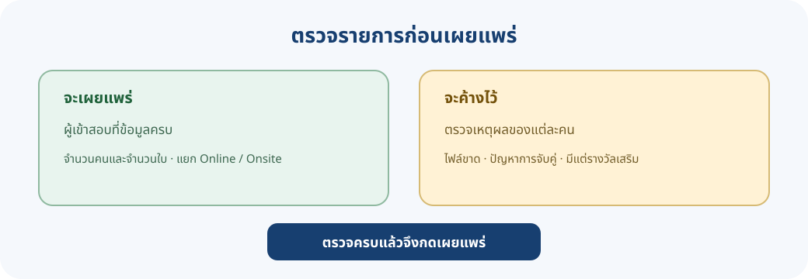

1. ตรวจจำนวนผู้เข้าสอบทั้งหมด แยก Online และ Onsite
2. ตรวจจำนวนเกียรติบัตรที่พร้อมเผยแพร่
3. ตรวจรายการที่ต้องตัดสินและผู้ที่ยังขาดไฟล์หรือรางวัลหลัก
4. หากผู้เข้าสอบมีทั้งรางวัลหลักและรางวัลเสริม ระบบอาจให้เลือกนโยบายการแสดง:
   - **ทุกใบ** — แสดงทั้งรางวัลหลักและรางวัลเสริมที่ผ่านการตรวจ
   - **เฉพาะใบรางวัลหลัก** — ซ่อนรางวัลเสริมของผู้ที่มีรางวัลหลักด้วย โดยไม่ลบไฟล์
5. ตรวจสรุปจำนวนที่จะเผยแพร่และจำนวนที่จะค้าง แล้วกด **เผยแพร่**

ระบบเผยแพร่เป็นรายคน คนที่ข้อมูลครบจะค้นหาได้ ส่วนคนที่ยังมีปัญหาจะค้างไว้จนกว่าจะแก้ครบ คนที่มีเฉพาะรางวัลเสริมจะเผยแพร่ได้เมื่อแอดมินยืนยันว่าได้รับเฉพาะรางวัลเสริมจริง

หากต้องแก้รอบที่เผยแพร่แล้ว:

1. เตรียมข้อมูลและไฟล์ที่ถูกต้องให้พร้อมก่อน
2. กด **ยกเลิกการเผยแพร่**
3. แก้รายชื่อหรือไฟล์ แล้วตรวจรายการค้างใหม่
4. กดเผยแพร่อีกครั้งหลังตรวจยอดครบ

> การยกเลิกเผยแพร่ทำให้ผู้ใช้ทั่วไปค้นหาเกียรติบัตรของทั้งรอบนั้นไม่พบชั่วคราว จนกว่าแอดมินจะเผยแพร่ใหม่

รอบที่แจ้งว่าเป็นข้อมูลจากระบบเดิมอาจยังเผยแพร่อยู่ แต่ไม่สามารถแก้หรือเผยแพร่ใหม่ตามขั้นตอนปัจจุบันได้ หากยกเลิกเผยแพร่ รอบเดิมจะเผยแพร่กลับไม่ได้ โปรดตรวจคำเตือนบนหน้าจอก่อนดำเนินการ

### 9. การดูแลรอบนำเข้าและปิดปรับปรุง

#### ปิดหน้าค้นหาชั่วคราว

หน้า **รอบการนำเข้า** มีส่วน **ระบบปิดปรับปรุง** ใช้สวิตช์ **โหมดปิดปรับปรุง** เพื่อปิดการค้นหาและการขอลิงก์ดาวน์โหลดใหม่ ระหว่างเปิดโหมดนี้ ผู้ใช้จะเห็นประกาศปิดปรับปรุง ส่วนหลังบ้านยังใช้งานได้

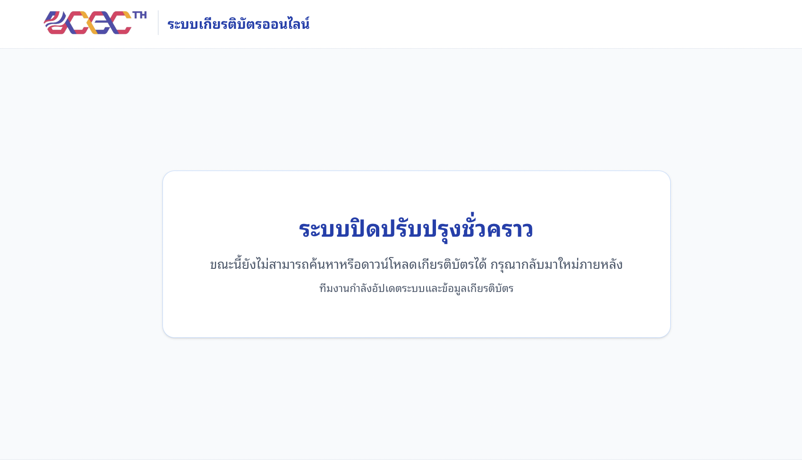

เมื่อดำเนินงานเสร็จ ให้ปิดโหมดปรับปรุง แล้วทดสอบค้นหาและบันทึกไฟล์จากหน้าเว็บผู้ใช้ ลิงก์ดาวน์โหลดที่ออกก่อนเปิดโหมดอาจใช้ได้ต่อจนหมดอายุ ซึ่งโดยปกติประมาณ 15 นาที

#### อายุการเก็บไฟล์

ระบบแสดงวันครบกำหนดเก็บไฟล์ในหน้ารอบนำเข้า โดยเริ่มนับ 2 ปีจากวันที่เผยแพร่ หากมีเหตุจำเป็นต้องเก็บต่อ ให้กด **ต่ออายุอีก 1 ปี** ก่อนวันที่ไฟล์ถูกลบ เมื่อไฟล์ถูกลบแล้ว ผู้ใช้ทั่วไปจะค้นหาเกียรติบัตรนั้นไม่พบ แม้ข้อมูลผู้เข้าสอบและประวัติการแก้ไขยังอยู่

#### การเคลียร์ ZIP ต้นฉบับ

ZIP เป็นไฟล์ขนาดใหญ่ ระบบจะเคลียร์ไฟล์ต้นฉบับโดยอัตโนมัติเมื่อเผยแพร่ครบ ไม่มีหน้าค้างที่ต้องตัดสิน และผู้เข้าสอบมีไฟล์ครบหรือได้รับการยืนยันใช้เฉพาะรางวัลเสริมแล้ว

ในแผง **ไฟล์ต้นฉบับ** ระบบแสดงเหตุผลหากยังเคลียร์ไม่ได้ เมื่อเงื่อนไขครบสามารถกด **ตรวจและเคลียร์เดี๋ยวนี้** ได้ หลังเคลียร์ ZIP แล้ว หากต้องนำเข้าจากต้นฉบับอีกครั้ง ต้องเลือก ZIP จากเครื่องและอัปโหลดใหม่

#### การลบรอบนำเข้าทั้งรอบ

คำสั่งลบรอบอยู่ใน **โซนอันตราย** ท้ายหน้ารอบ ใช้เฉพาะกรณีต้องการลบรอบผิดปี ผิดรายการ หรือเริ่มนำเข้าใหม่ทั้งชุด ระบบให้พิมพ์ชื่อรอบเพื่อยืนยัน และหากรอบเผยแพร่อยู่จะเตือนว่าผู้ใช้ทั่วไปจะค้นไม่พบ

การลบรอบนำเข้าจะนำรายชื่อ เกียรติบัตร รูปตัวอย่าง และไฟล์ต้นฉบับของรอบนั้นออก กู้คืนจากหน้าเว็บไม่ได้ ก่อนยืนยันต้องตรวจรอบ ปี และไฟล์สำรองให้แน่ใจ หากผิดเพียงบางหน้า ให้ใช้คำสั่งทิ้งหรือแก้เฉพาะหน้านั้นแทนการลบรอบทั้งหมด

### 10. ปัญหาที่แอดมินพบบ่อย

| ปัญหา | สาเหตุที่พบบ่อย | วิธีดำเนินการ |
|---|---|---|
| อัปโหลด Excel ไม่ได้ | ไฟล์ไม่ใช่ .xlsx หรือไม่มีหัวคอลัมน์จำเป็น | ใช้ไฟล์ .xlsx และตรวจว่ามี Candidate No, Candidate Name และ Exam Mode |
| ระบบแจ้งเลขผู้เข้าสอบไม่ถูกต้องหรือซ้ำ | มีอักขระอื่นในเลข หรือเลขซ้ำระหว่าง Online/Onsite | แก้ให้เป็นเลขตัวเลขตาม Cert No และยืนยันเลขซ้ำกับต้นทาง |
| ระบบแจ้งรูปแบบการสอบไม่ถูกต้อง | ค่าไม่ใช่ ONLINE หรือ ONSITE | แก้ค่าใน Excel ให้ตรงกับข้อมูลจากต้นทาง |
| อัปโหลด ZIP ไม่ได้ทั้งไฟล์ | โครงสร้างผิด มีโฟลเดอร์รางวัลไม่รู้จัก หรือมีไฟล์ชนิดอื่น | เปิดปุ่มดูโครงสร้าง ZIP ที่รับ ตรวจทุกโฟลเดอร์และใช้โครงสร้างแบบเดียวตลอด ZIP |
| ZIP ไม่มีรางวัลที่ระบบรู้จัก | ชื่อโฟลเดอร์ไม่ตรงกับรายการของโปรแกรม/รอบ | ใช้ชื่อจากรายการที่แสดงบนหน้าอัปโหลด ตรวจปีและรอบที่เลือก |
| ระบบยังประมวลผลอยู่ | กำลังตรวจ Excel ตัด PDF หรือจับคู่ข้อมูล | รอให้สถานะงานเสร็จแล้วรีเฟรช หลีกเลี่ยงการอัปโหลดไฟล์เดิมซ้ำระหว่างมีงาน |
| PDF รายคนไม่ผ่าน | เลขหรือชื่อบนไฟล์ไม่ตรงกับผู้เข้าสอบ หรือไฟล์รวมหลายหน้าและแยกหน้าไม่ชัด | ตรวจผู้เข้าสอบและรางวัลที่เลือก ขอไฟล์ที่ถูกต้อง หรือแยกหน้าที่ต้องการเป็น PDF |
| ปุ่มแก้ไขหรืออัปโหลดถูกปิด | รอบกำลังเผยแพร่ มีงานประมวลผลอยู่ หรือเป็นรอบเดิมจากระบบเก่า | ตรวจข้อความกำกับ รอให้งานเสร็จ หรือยกเลิกการเผยแพร่ก่อนหากเป็นรอบปัจจุบัน |
| ผู้เข้าสอบยังค้างหลังเพิ่มชื่อ | ข้อมูลที่บันทึกยังไม่ตรงกับเลขหรือชื่อบนหน้า | ตรวจข้อมูลรายคนและหลักฐานจากต้นทาง รอระบบจับคู่ใหม่ แล้วตรวจรายการค้างอีกครั้ง |
| มีข้อความประมวลผลล้มเหลว | เป็นข้อผิดพลาดของงานระบบ ไม่ใช่เพียงรูปแบบไฟล์ผิด | บันทึกข้อความผิดพลาดและแจ้งผู้ดูแลระบบ พร้อมชื่อรอบและปีที่เกี่ยวข้อง |
